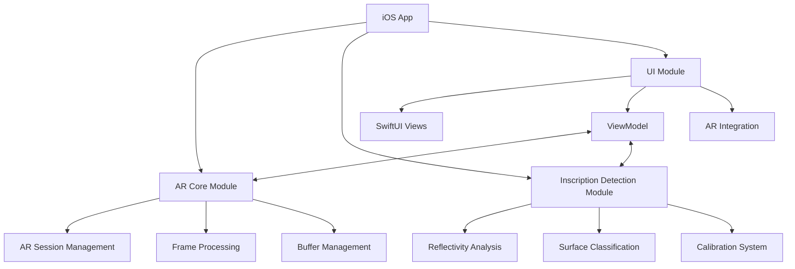
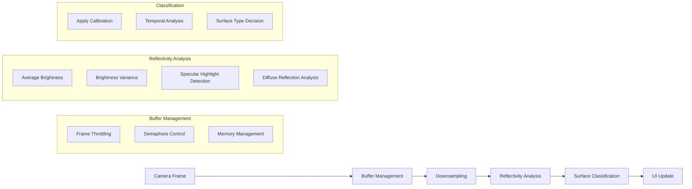
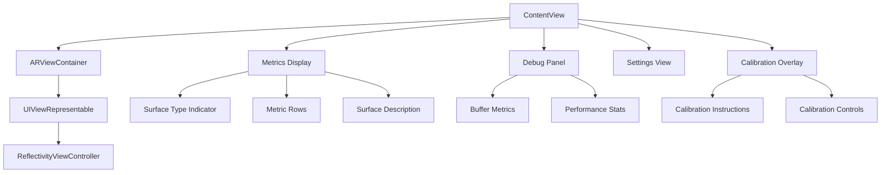
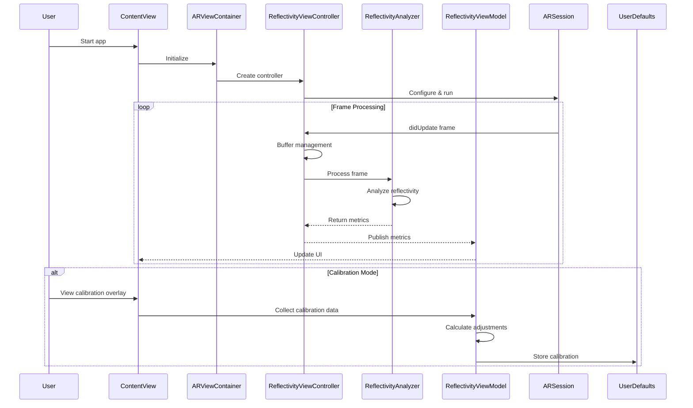

# Reflectivity Detection App for Archaeological Inscription Analysis - Architecture Documentation

This document describes the current architecture of the Reflectivity Detection App, which uses augmented reality to detect reflective surfaces for identifying faint inscriptions on archaeological artifacts.

## 1. Overall System Architecture



## 2. File Structure

```
ReflectivityDetection/
├── App/
│   ├── AppDelegate.swift
│   ├── SceneDelegate.swift
│   └── ReflectivityDetectionApp.swift
├── Core/
│   ├── AR/
│   │   └── ReflectivityViewController.swift
│   ├── ImageProcessing/
│   └── InscriptionDetection/
│       └── ReflectivityAnalyzer.swift
├── Models/
│   ├── SurfaceType.swift
│   └── ARBufferMetrics.swift
├── UI/
│   ├── ViewModels/
│   │   └── ReflectivityViewModel.swift
│   └── Views/
│       └── ContentView.swift
├── Resources/
│   └── Documentation/
├── Utilities/
├── Info.plist
├── LaunchScreen.storyboard
└── Assets.xcassets/
```

## 3. Core Components and Classes

### 3.1 Main Components

#### App Structure
- **AppDelegate**: Standard UIKit app delegate with lifecycle methods
- **SceneDelegate**: Configures the SwiftUI ContentView as the root view
- **ReflectivityDetectionApp**: SwiftUI App structure with splash screen implementation

#### ReflectivityViewController
The central controller managing the AR session, frame processing, and buffer management:
- Configures and manages ARKit session
- Processes camera frames with optimized buffer handling
- Implements performance optimizations for real-time analysis
- Publishes metrics via Combine framework

#### ReflectivityAnalyzer
Implements algorithms for detecting surface reflectivity:
- Analyzes frames for specular highlights and diffuse reflection
- Classifies surfaces based on reflectivity characteristics
- Applies calibration adjustments to detection thresholds
- Optimizes processing with downsampling and efficient image analysis

#### ReflectivityViewModel
Manages UI state and business logic:
- Receives metrics from AR components via Combine publishers
- Handles calibration workflow and data collection
- Provides observable state for SwiftUI views
- Stores calibration parameters in UserDefaults

#### ContentView
Main SwiftUI view that integrates AR with user interface:
- Embeds AR view using UIViewRepresentable
- Displays real-time metrics and surface classification
- Provides debug information and settings controls
- Shows calibration overlay when needed

## 4. Reflectivity Detection Implementation

### 4.1 Detection Pipeline



### 4.2 Algorithm Implementation

1. **Buffer Management and Optimization**
   - Frame throttling to prevent CPU overload (300ms interval)
   - Semaphore-based buffer control to limit concurrent processing
   - Pixel buffer copying to prevent ARKit buffer reuse issues
   - Aggressive downsampling (25% of original size) for performance

2. **Reflectivity Analysis Techniques**
   - Average brightness calculation using CIFilter.areaAverage
   - Brightness variance calculation with grid sampling
   - Specular highlight detection with adaptive thresholding
   - Diffuse reflection scoring based on brightness distribution

3. **Temporal Analysis**
   - Brightness history tracking for stability
   - Exponential moving average for metrics
   - Performance metrics tracking over time

4. **Memory Management**
   - Autoreleasepool usage for buffer handling
   - Explicit buffer cleanup after processing
   - Limited history size for metrics tracking

### 4.3 Calibration System

The app implements a calibration system that significantly improves detection accuracy by adapting to environmental conditions:

1. **Calibration Process**
   - Collects multiple samples of reflectivity metrics
   - Analyzes baseline values for the current environment
   - Calculates adjustment factors for detection thresholds
   - Stores calibration parameters in UserDefaults

2. **Threshold Adjustments**
   - Specular threshold adjustment based on baseline specular score
   - Diffuse threshold adjustment based on baseline diffuse score
   - Brightness variance baseline establishment

3. **Calibration Effects on Detection**
   - In low-reflectivity environments: Increases sensitivity by lowering thresholds
   - In high-reflectivity environments: Decreases sensitivity by raising thresholds
   - Provides consistent detection across varying lighting conditions

4. **User Interface for Calibration**
   - Guided calibration workflow with instructions
   - Visual feedback during calibration process
   - Manual completion option

## 5. UI Implementation

### 5.1 SwiftUI Interface Components



### 5.2 UI Features

1. **AR View Integration**
   - UIViewRepresentable wrapper for ARSCNView
   - Coordinator pattern for controller lifecycle management
   - Full-screen AR experience with overlay UI

2. **Real-time Metrics Display**
   - Surface type indicator with color coding
   - Visual progress bars for reflectivity metrics
   - Detailed surface description

3. **Debug Information Panel**
   - Buffer queue length monitoring
   - Frame drop rate visualization
   - Processing time statistics
   - Collapsible UI for unobtrusive debugging

4. **Settings Interface**
   - Detection mode configuration
   - Visualization options
   - App information

5. **Calibration Interface**
   - Step-by-step instructions
   - Visual guidance for optimal calibration
   - Manual completion option

## 6. Data Models and State Management

### 6.1 Core Data Models

1. **SurfaceType**
   - Enum with cases: shiny, matte, unknown
   - Properties for description, color, and threshold values
   - Used for classification and UI representation

2. **ReflectivityMetrics**
   - Stores analysis results: specularScore, diffuseScore
   - Tracks brightness metrics: brightnessVariance, averageBrightness
   - Contains current surfaceType classification

3. **ARBufferMetrics**
   - Tracks performance: framesProcessed, totalFramesReceived
   - Monitors processing times: averageProcessingTime, peakProcessingTime
   - Calculates drop rate for performance monitoring

### 6.2 State Management with Combine

1. **Publisher/Subscriber Pattern**
   - ReflectivityViewController publishes metrics via PassthroughSubject
   - ReflectivityViewModel subscribes to metrics and updates UI state
   - Decouples AR processing from UI updates

2. **Observable State**
   - ReflectivityViewModel as ObservableObject
   - @Published properties trigger UI updates
   - Centralized state management for consistent UI

3. **Calibration State**
   - Tracks calibration progress and completion
   - Collects and processes calibration samples
   - Persists calibration parameters to UserDefaults

## 7. Data Flow Architecture



## 8. Performance Optimizations

1. **Frame Processing Efficiency**
   - Throttled frame processing (300ms interval)
   - Semaphore-based concurrency control
   - Pixel buffer copying to prevent ARKit buffer conflicts
   - Aggressive downsampling (25% of original size)

2. **Memory Management**
   - Autoreleasepool usage for buffer handling
   - Explicit buffer cleanup after processing
   - Limited history size for metrics tracking
   - Shared CIContext to avoid repeated creation

3. **AR Configuration Optimization**
   - Optimal video format selection based on device capabilities
   - Disabled environment texturing for performance
   - Simplified frame semantics
   - Light estimation enabled only when needed

4. **Processing Pipeline Optimizations**
   - Grid-based sampling for variance calculation
   - Sparse pixel sampling for highlight detection
   - Fixed buffer sizes to prevent large allocations
   - Shared image processing context

## 9. Future Enhancements

1. **Archaeological Features**
   - Artifact cataloging integration
   - Multi-spectral analysis support
   - Field-optimized mode with offline capabilities

2. **Technical Improvements**
   - Machine learning for pattern recognition
   - 3D mapping of reflective surfaces
   - Batch processing for multiple artifacts

3. **Collaborative Tools**
   - Remote expert sharing
   - Cloud backup integration
   - Version history for findings

4. **Advanced Visualization**
   - Enhanced overlay modes
   - Split-screen comparison views
   - 3D visualization of inscriptions