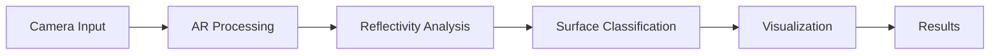
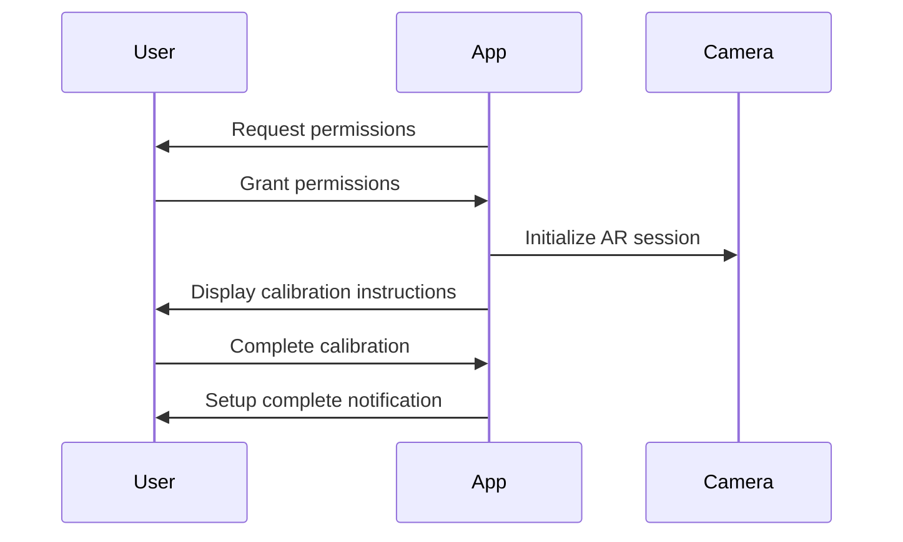
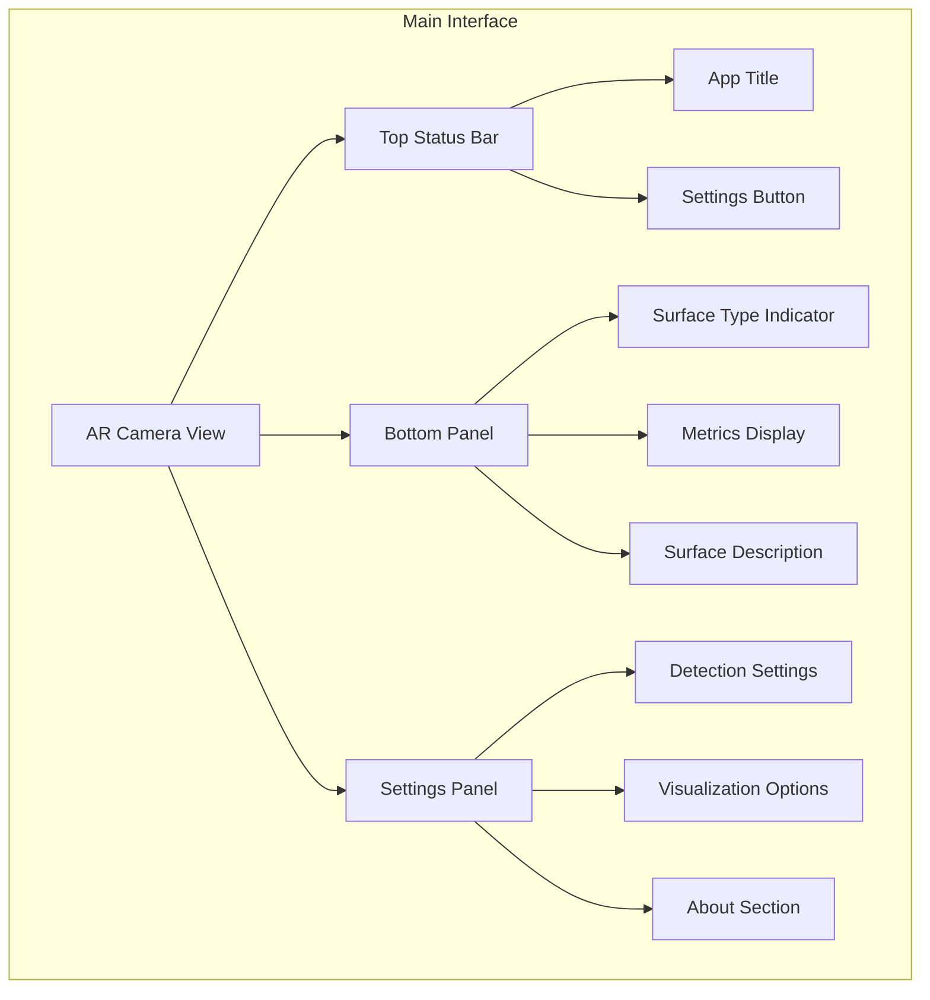
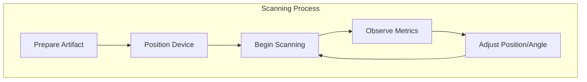
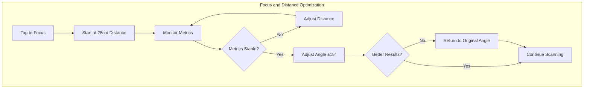
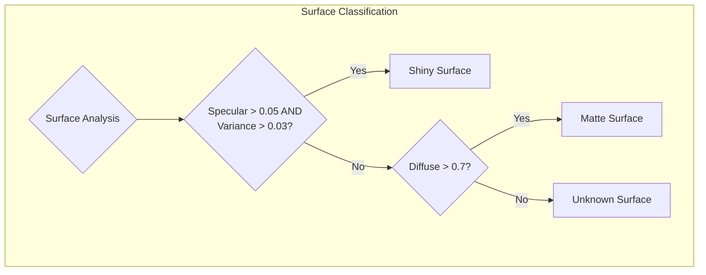
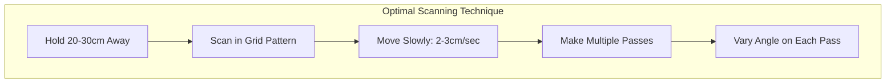
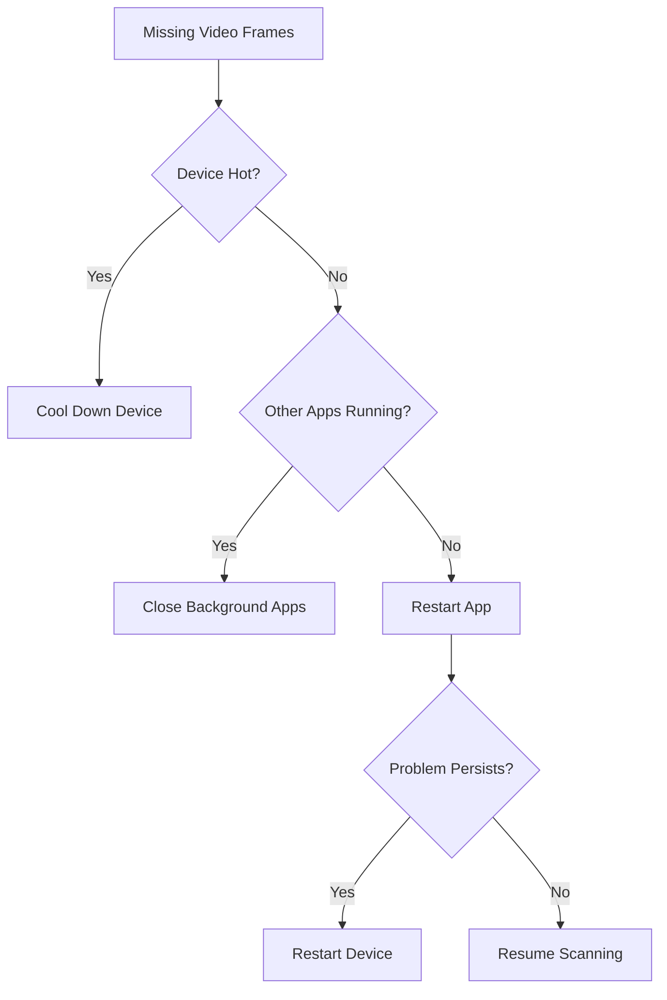

# ReflectivityDetection App User Guide

## Table of Contents
1. [Introduction](#introduction)
2. [Getting Started](#getting-started)
3. [Main Interface](#main-interface)
4. [Using the App](#using-the-app)
5. [Advanced Features](#advanced-features)
6. [Tips for Best Results](#tips-for-best-results)
7. [Troubleshooting](#troubleshooting)
8. [Appendix](#appendix)

## Introduction

The ReflectivityDetection app is a specialized tool designed for archaeological research that uses augmented reality (AR) technology to detect and analyze reflective surfaces on artifacts. By identifying subtle variations in surface reflectivity, the app can help archaeologists discover faint inscriptions, engravings, or markings that might be invisible to the naked eye.

### How It Works

The app uses your device's camera and AR capabilities to:
1. Analyze how light reflects off artifact surfaces in real-time
2. Detect both specular (mirror-like) and diffuse (scattered) reflections
3. Identify patterns that may indicate the presence of inscriptions
4. Classify surfaces based on their reflective properties

### Key Features

- **Real-time reflectivity analysis**: Instantly analyze surfaces as you scan
- **Surface type classification**: Automatically identify shiny, matte, or unknown surfaces
- **Metrics visualization**: View detailed reflectivity metrics with intuitive displays
- **AR-based detection**: Use augmented reality for precise spatial awareness
- **Archaeological optimization**: Specifically designed for artifact analysis

## Getting Started

### System Requirements

- iOS 15.0 or later
- iPhone or iPad with ARKit support
- Sufficient storage space for the app (approximately 100MB)

### Installation

1. Download the ReflectivityDetection app from the App Store
2. Open the app and grant the necessary permissions when prompted
3. Follow the on-screen instructions to complete the setup

### Required Permissions

The app requires the following permissions to function properly:

- **Camera access**: Essential for scanning artifacts and detecting reflectivity
- **Motion & orientation access**: Required for AR functionality
- **Photo library access** (optional): Only needed if you want to save results

### Initial Setup

When you first launch the app, you'll be guided through a brief calibration process:

1. Point your device at a well-lit, neutral surface
2. Follow the on-screen instructions to complete the calibration
3. The app will confirm when calibration is successful

## Main Interface

The ReflectivityDetection app features an intuitive interface designed for archaeological fieldwork. Below is a breakdown of the main interface components:

### AR Camera View

The main portion of the screen displays the live camera feed with AR overlays. This is where you'll point your device at artifacts to analyze their surfaces.

### Top Status Bar

- **App Title**: Displays "Reflectivity Detection"
- **Settings Button**: Tap the gear icon to access app settings

### Bottom Panel

- **Surface Type Indicator**: A colored circle and label showing the detected surface type (shiny, matte, or unknown)
- **Metrics Display**: Visual and numerical representation of key reflectivity metrics
- **Surface Description**: Brief description of the detected surface properties

### Metrics Display

The metrics display shows four key measurements:

1. **Specular Score**: Measures mirror-like reflections (0.0-1.0)
2. **Diffuse Score**: Measures scattered reflections (0.0-1.0)
3. **Brightness**: Average brightness of the analyzed surface (0.0-1.0)
4. **Variance**: Variation in brightness across the surface (0.0-1.0)

Each metric is displayed with:
- A descriptive label
- A progress bar showing the value visually
- A numerical value (0.00-1.00)

### Settings Panel

Access the settings panel by tapping the gear icon in the top-right corner. It includes:

- **Detection Settings**: Options to adjust sensitivity and detection mode
- **Visualization Options**: Controls for how results are displayed
- **About Section**: App information and version details

## Using the App

### Scanning Artifacts for Reflective Surfaces

Follow these steps to effectively scan artifacts:

1. **Prepare the artifact**:
   - Clean the surface gently (if appropriate and permitted)
   - Position in a well-lit environment
   - Avoid direct glare from light sources

2. **Position your device**:
   - Hold 20-30 cm (8-12 inches) from the artifact surface
   - Start with the device perpendicular to the surface
   - Ensure the entire area of interest is visible on screen

3. **Begin scanning**:
   - Move slowly and steadily across the surface
   - Maintain consistent distance
   - Watch for highlighted areas that may indicate inscriptions

### Adjusting Focus and Distance

Proper focus and distance are crucial for accurate results:

1. **Focusing on specific areas**:
   - Tap on the screen to focus on a particular point
   - A yellow indicator will briefly appear at the tapped location
   - The app will optimize detection for that specific area

2. **Finding the optimal distance**:
   - Start at approximately 25 cm (10 inches) from the surface
   - Watch the metrics display as you slowly move closer or further
   - The optimal distance is when metrics stabilize and values are highest
   - Too close: metrics will fluctuate rapidly
   - Too far: values will be too low for accurate detection

3. **Angle adjustments**:
   - Start perpendicular to the surface
   - Slowly adjust the angle (±15°) to catch different reflection patterns
   - Some inscriptions are only visible at specific angles

### Interpreting the Reflectivity Metrics

Understanding the metrics is key to successful inscription detection:

#### Specular Score
- **What it measures**: Mirror-like reflections where light bounces off at the same angle
- **High values (>0.7)**: Indicate shiny, polished surfaces
- **Low values (<0.3)**: Indicate rough or matte surfaces
- **For inscriptions**: Look for variations in specular score across the surface

#### Diffuse Score
- **What it measures**: Scattered reflections where light bounces in multiple directions
- **High values (>0.7)**: Indicate matte, textured surfaces
- **Low values (<0.3)**: Indicate very smooth or shiny surfaces
- **For inscriptions**: Higher diffuse scores often indicate textured areas with potential inscriptions

#### Brightness Variance
- **What it measures**: How much the brightness changes across the surface
- **High values**: Indicate uneven surfaces with potential inscriptions
- **Low values**: Indicate uniform surfaces
- **For inscriptions**: Higher variance often correlates with inscribed areas

#### Average Brightness
- **What it measures**: Overall light level of the analyzed area
- **Optimal range**: 0.4-0.7 for most accurate detection
- **Too high (>0.8)**: May indicate overexposure
- **Too low (<0.3)**: May indicate insufficient lighting

### Understanding Surface Type Classifications

The app classifies surfaces into three categories:

#### Shiny
- **Characteristics**: High specular score, low diffuse score
- **Appearance**: Reflective, mirror-like surface
- **Color indicator**: Blue
- **Best detection approach**: Vary the angle to catch reflections

#### Matte
- **Characteristics**: High diffuse score, low specular score
- **Appearance**: Textured, non-reflective surface
- **Color indicator**: Green
- **Best detection approach**: Use consistent, diffuse lighting

#### Unknown
- **Characteristics**: Mixed or inconclusive metrics
- **Appearance**: Could be partially reflective or have varying properties
- **Color indicator**: Gray
- **Best detection approach**: Try different lighting conditions and angles

## Advanced Features

### Detection Settings

Access these settings by tapping the gear icon in the top-right corner:

#### Enhanced Detection
- **Function**: Activates advanced algorithms for subtle inscription detection
- **When to use**: For faint or weathered inscriptions
- **Note**: May increase processing time and battery usage

#### Show Highlights
- **Function**: Visually highlights potential inscription areas on screen
- **When to use**: To quickly identify areas of interest
- **Note**: Can be toggled off for clearer view of the artifact

#### Detection Mode
- **Standard**: Balanced performance for most artifacts
- **High Sensitivity**: Optimized for very faint inscriptions (slower processing)
- **Archaeological**: Specifically tuned for ancient stone and ceramic artifacts

### Visualization Options

#### Show Metrics
- **Function**: Toggles the display of numerical metrics
- **When to use**: When you need precise measurements
- **Note**: Can be turned off for a cleaner interface

#### Highlight Reflective Areas
- **Function**: Overlays color-coded highlights on reflective areas
- **When to use**: To visually identify potential inscription areas
- **Note**: Colors indicate confidence level (yellow: high, orange: medium, red: low)

#### Highlight Intensity
- **Function**: Adjusts the visibility of the AR highlights
- **When to use**: Increase for subtle inscriptions, decrease for obvious ones
- **Note**: Slider ranges from 0.0 (minimal) to 1.0 (maximum)

## Tips for Best Results

### Lighting Conditions

Proper lighting is crucial for accurate reflectivity detection:

- **Ideal lighting**: Diffuse, even lighting from multiple directions
- **Avoid**: Direct sunlight or single-point light sources
- **Try**: Ambient room lighting or overcast outdoor conditions
- **For difficult artifacts**: Try moving to different lighting environments
- **Professional setup**: Consider using a light tent or diffused photography lights

### Scanning Techniques

Follow these techniques for optimal results:

- **Slow, steady movement**: Move at approximately 2-3 cm per second
- **Systematic approach**: Scan in a grid pattern to cover the entire surface
- **Multiple passes**: Scan the same area from different angles
- **Distance consistency**: Maintain a consistent distance from the surface
- **Patience**: Allow the metrics to stabilize before making judgments

### Surface Preparation

When permitted and appropriate for the artifact:

- **Gentle cleaning**: Remove dust or loose debris
- **Positioning**: Place on a neutral, non-reflective background
- **Stabilization**: Ensure the artifact doesn't move during scanning
- **Temperature**: Allow artifacts to reach room temperature (cold artifacts may develop condensation)

### Environmental Considerations

- **Ambient light**: Control room lighting when possible
- **Reflective surroundings**: Minimize nearby reflective objects
- **Device temperature**: Avoid using the app when your device is overheating
- **Battery level**: Ensure sufficient battery (at least 20%) for consistent performance

## Troubleshooting

### Missing Video Frames (OutOfBuffers)

**Symptoms:**
- Jerky or freezing camera view
- "OutOfBuffers" warning message
- Inconsistent metrics

**Solutions:**
1. Close other apps running in the background
2. Restart the ReflectivityDetection app
3. If persistent, restart your device
4. Ensure your device isn't overheating

### Missing Camera Calibration Data

**Symptoms:**
- "Camera calibration incomplete" message
- Inaccurate metrics
- Poor AR tracking

**Solutions:**
1. Ensure adequate lighting for calibration
2. Point camera at a textured, non-reflective surface
3. Move device slowly in a figure-8 pattern
4. If persistent, go to Settings > ReflectivityDetection > Reset Calibration
5. Restart the app and recalibrate

### SLAM Errors Due to Significant Frame Data Drops

**Symptoms:**
- "SLAM tracking lost" message
- AR elements jumping or drifting
- Unstable metrics

**Solutions:**
1. Ensure adequate lighting in the environment
2. Move the device more slowly
3. Scan surfaces with more visual features
4. Avoid rapid changes in lighting conditions
5. If persistent, restart the AR session via Settings > Reset AR Session

### Issues with Camera Sensors

**Symptoms:**
- Blurry or distorted camera view
- Consistently inaccurate metrics
- Camera unable to focus

**Solutions:**
1. Clean the camera lens with a microfiber cloth
2. Ensure no case or cover is obstructing the camera
3. Test in different lighting conditions
4. If using an older device, be aware of potential hardware limitations
5. If problems persist across multiple apps, contact device manufacturer

### Performance Issues

**Symptoms:**
- App running slowly
- Excessive battery drain
- Device heating up

**Solutions:**
1. Close background apps
2. Reduce screen brightness
3. Switch to Standard detection mode
4. Disable unnecessary visualization features
5. Ensure device has adequate free storage space
6. If persistent, restart device

## Appendix

### Glossary of Terms

- **AR (Augmented Reality)**: Technology that overlays digital information on the real world
- **Diffuse reflection**: Light that bounces off a surface in multiple directions
- **Specular reflection**: Mirror-like reflection where light bounces at the same angle as it hits the surface
- **SLAM (Simultaneous Localization and Mapping)**: Technology that tracks device position in space
- **Reflectivity**: Measure of how much light is reflected by a surface
- **Calibration**: Process of optimizing the camera for accurate measurements
- **Surface variance**: Measurement of how much a surface's properties change across its area

### Quick Reference Guide

| Issue | Quick Fix |
|-------|-----------|
| Unstable metrics | Move more slowly |
| Poor detection | Check lighting conditions |
| App freezing | Close background apps |
| Battery drain | Lower screen brightness |
| Inaccurate classification | Try different angles |
| Calibration problems | Use textured surface for calibration |

### Contact Information

For technical support or feedback:
- Email: support@reflectivityapp.com
- Website: www.reflectivityapp.com/support
- In-app: Settings > Help & Support > Contact Us